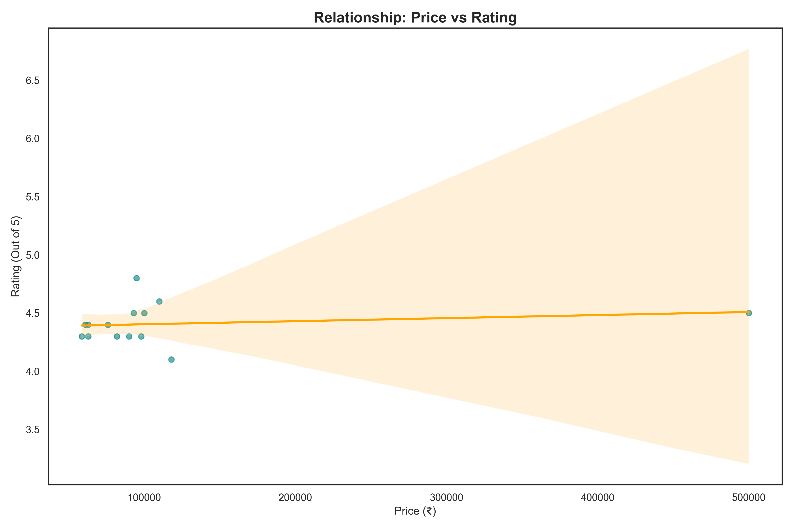
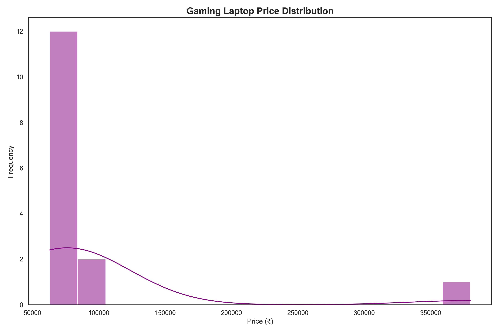
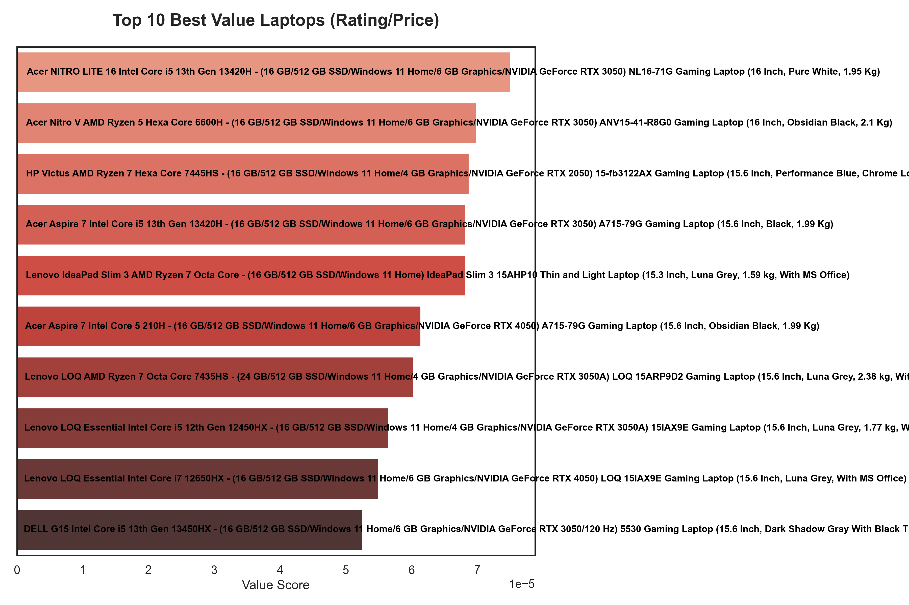

# ecommerce-laptop-price-analyzer
Scrapes, cleans and visualizes gaming laptop data
# Laptop Price Analyzer (Flipkart)

## 📌 Problem
Students find it hard to compare gaming laptops across price, rating and specs.

## 💡 Solution
This project builds an automated data pipeline to:
- Scrape laptop data from Flipkart
- Clean and remove duplicates
- Rank laptops by value
- Visualize insights

## 🛠 Tech Stack
- Python
- BeautifulSoup
- Requests
- Pandas
- Matplotlib

## ⚙ Workflow
1. `scraper.py` → collects product data  
2. `analysis.py` → cleans + ranks  
3. `visualize.py` → generates charts  

## 📂 Outputs
- `data/Laptop.csv`
- `data/cleaned_laptops.csv`
- Charts in `data/` folder

## ▶ How to Run
```bash
pip install -r requirements.txt
python main.py

## 📊 Sample Charts

### Top 10 Cheapest Laptops


### Price vs Rating


### Price Distribution


### Best Value Laptops

